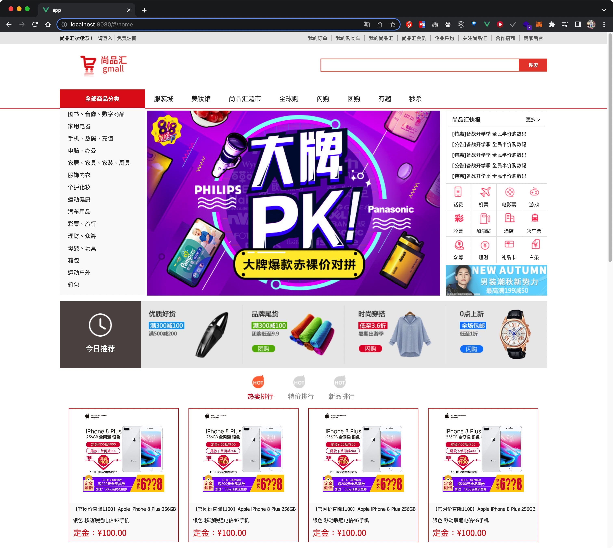
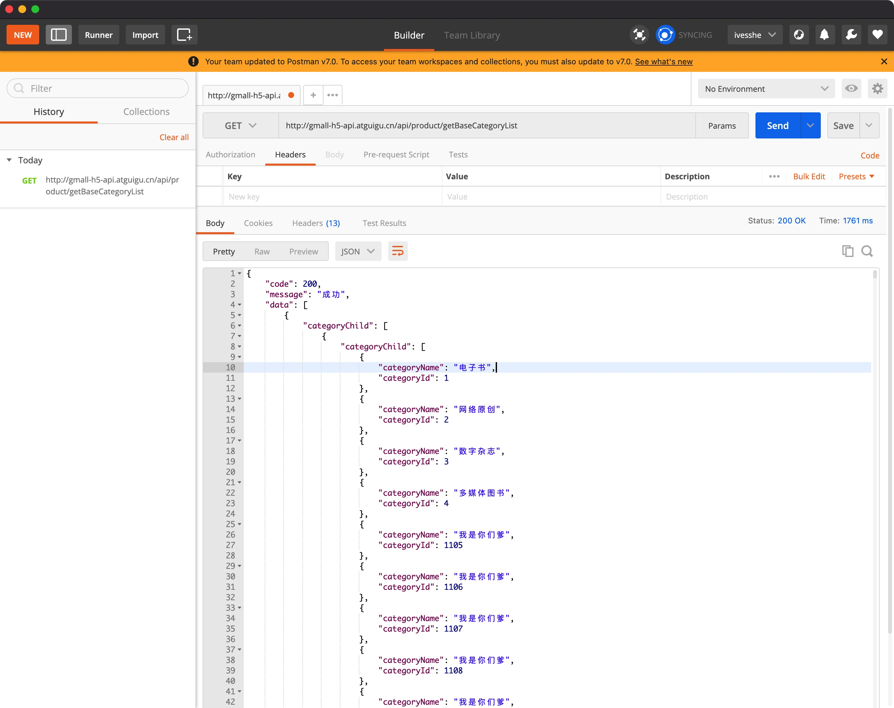

# Vue 尚品匯前台

實作記錄，方便之後查看，持續構建中



# webpack版本

採用4版本

# vue-cli版本

採用4版本

# 初始化項目

```bash
vue create 項目名
```

# vue-cli版本

版本4跟版本5在配置上有不同，若是舊的專案需注意

# 安裝less

注意版本號， less-loader採用5版本

```bash
npm i --save less less-loader@5
```

# 引入reset.css

```css
@import "./iconfont.css";
 
/* 清除内外边距 */
body, h1, h2, h3, h4, h5, h6, hr, p, blockquote,
dl, dt, dd, ul, ol, li,
pre,
fieldset, lengend, button, input, textarea,
th, td {
    margin: 0;
    padding: 0;
}

/* 设置默认字体 */
body,
button, input, select, textarea { /* for ie */
    /*font: 12px/1 Tahoma, Helvetica, Arial, "宋体", sans-serif;*/
    font: 12px/1.3 "Microsoft YaHei",Tahoma, Helvetica, Arial, "\5b8b\4f53", sans-serif; /* 用 ascii 字符表示，使得在任何编码下都无问题 */
    color: #333;
}


h1 { font-size: 18px; /* 18px / 12px = 1.5 */ }
h2 { font-size: 16px; }
h3 { font-size: 14px; }
h4, h5, h6 { font-size: 100%; }

address, cite, dfn, em, var, i{ font-style: normal; } /* 将斜体扶正 */
b, strong{ font-weight: normal; } /* 将粗体扶细 */
code, kbd, pre, samp, tt { font-family: "Courier New", Courier, monospace; } /* 统一等宽字体 */
small { font-size: 12px; } /* 小于 12px 的中文很难阅读，让 small 正常化 */

/* 重置列表元素 */
ul, ol { list-style: none; }

/* 重置文本格式元素 */
a { text-decoration: none; color: #666;}


/* 重置表单元素 */
legend { color: #000; } /* for ie6 */
fieldset, img { border: none; }
button, input, select, textarea {
    font-size: 100%; /* 使得表单元素在 ie 下能继承字体大小 */
}

/* 重置表格元素 */
table {
    border-collapse: collapse;
    border-spacing: 0;
}

/* 重置 hr */
hr {
    border: none;
    height: 1px;
}
.clearFix::after{
	content:"";
	display: block;
	clear:both;
}
/* 让非ie浏览器默认也显示垂直滚动条，防止因滚动条引起的闪烁 */
html { overflow-y: scroll; }

a:link:hover{
    color : rgb(79, 76, 212) !important;
    text-decoration: underline;
}

/* 清除浮动 */
.clearfix::after {
    display: block;
    height: 0;
    content: "";
    clear: both;
    visibility: hidden;
}
```

# 路由

安裝vue-router 版本3.5.3

```bash
npm i --save vue-router@3.5.3
```


# 測試接口

最新接口位址

http://gmall-h5-api.atguigu.cn/

http://gmall-h5-api.atguigu.cn/api/product/getBaseCategoryList



# 安裝axios

```bash
npm i --save axios
```