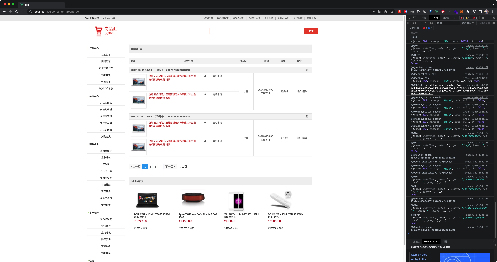

# Vue 尚品匯 電商購物平台


# 使用技術

- Vue2
- vue-router
- element-ui
- axios
- less
- mockjs
- nprogress
- qrcode
- swiper
- vee-validate
- vue-lazyload
- vuex
# 頁面展示

首頁


註冊頁


登入頁


商品列表頁


商品詳情頁


加入購物車


購物車


結算頁(上)


結算頁(下)


支付頁


支付頁-QRCODE彈窗

 

支付成功

 

我的訂單

 


團購訂單

 

搜尋頁

 
# webpack版本

採用4版本

# vue-cli版本

採用4版本

# 初始化項目

```bash
vue create 項目名
```

# vue-cli版本

版本4跟版本5在配置上有不同，若是舊的專案需注意

# 安裝less

注意版本號， less-loader採用5版本

```bash
npm i --save less less-loader@5
```

# 引入reset.css

```css
@import "./iconfont.css";
 
/* 清除内外边距 */
body, h1, h2, h3, h4, h5, h6, hr, p, blockquote,
dl, dt, dd, ul, ol, li,
pre,
fieldset, lengend, button, input, textarea,
th, td {
    margin: 0;
    padding: 0;
}

/* 设置默认字体 */
body,
button, input, select, textarea { /* for ie */
    /*font: 12px/1 Tahoma, Helvetica, Arial, "宋体", sans-serif;*/
    font: 12px/1.3 "Microsoft YaHei",Tahoma, Helvetica, Arial, "\5b8b\4f53", sans-serif; /* 用 ascii 字符表示，使得在任何编码下都无问题 */
    color: #333;
}


h1 { font-size: 18px; /* 18px / 12px = 1.5 */ }
h2 { font-size: 16px; }
h3 { font-size: 14px; }
h4, h5, h6 { font-size: 100%; }

address, cite, dfn, em, var, i{ font-style: normal; } /* 将斜体扶正 */
b, strong{ font-weight: normal; } /* 将粗体扶细 */
code, kbd, pre, samp, tt { font-family: "Courier New", Courier, monospace; } /* 统一等宽字体 */
small { font-size: 12px; } /* 小于 12px 的中文很难阅读，让 small 正常化 */

/* 重置列表元素 */
ul, ol { list-style: none; }

/* 重置文本格式元素 */
a { text-decoration: none; color: #666;}


/* 重置表单元素 */
legend { color: #000; } /* for ie6 */
fieldset, img { border: none; }
button, input, select, textarea {
    font-size: 100%; /* 使得表单元素在 ie 下能继承字体大小 */
}

/* 重置表格元素 */
table {
    border-collapse: collapse;
    border-spacing: 0;
}

/* 重置 hr */
hr {
    border: none;
    height: 1px;
}
.clearFix::after{
	content:"";
	display: block;
	clear:both;
}
/* 让非ie浏览器默认也显示垂直滚动条，防止因滚动条引起的闪烁 */
html { overflow-y: scroll; }

a:link:hover{
    color : rgb(79, 76, 212) !important;
    text-decoration: underline;
}

/* 清除浮动 */
.clearfix::after {
    display: block;
    height: 0;
    content: "";
    clear: both;
    visibility: hidden;
}
```

# 路由

安裝vue-router 版本3.5.3

```bash
npm i --save vue-router@3.5.3
```


# 測試接口

最新接口位址

http://gmall-h5-api.atguigu.cn/

http://gmall-h5-api.atguigu.cn/api/product/getBaseCategoryList


# 安裝axios

```bash
npm i --save axios
```

# 配置代理服務器

https://webpack.docschina.org/configuration/dev-server/

```js
module.exports = {
  //...
  devServer: {
    proxy: {
      '/api': {
        target: 'http://localhost:3000',
        pathRewrite: { '^/api': '' },
      },
    },
  },
};
```

# 安裝nprogress進度條

```bash
npm i --save nprogress
```

```js
import nprogress from 'nprogress'
import "nprogress/nprogress.css"

nprogress.start()
nprogress.done()
```

# 安裝vuex

注意版本

```bash
npm i --save vuex@3.6.2
```

使用模塊式

https://vuex.vuejs.org/zh/guide/modules.html

# lodash

中文官網

https://www.lodashjs.com/docs/lodash.debounce

官網

https://lodash.com/

# mock.js

官網

http://mockjs.com/


```bash
npm i mockjs
```

1. 在項目中src下創建mock文件夾
2. 准備json數據(mock文件夾下創建相應的json文件)，記得格式化，別留奇怪的空格
3. 把mock數據需要的圖片放置到public文件夾中
4. 創建mockServer.js通過mockjs插件實現模擬數據
5. mockServer.js在入口文件引入

# swiper

官網

https://swiper.com.cn/

使用版本5.4.5

1. 引包
2. 頁面結構務必要有
3. new Swiper實例(輪播圖添加動態效果)


```bash
npm i swiper@5
```


# 阿里圖標

https://www.iconfont.cn/


# Element UI

官網

https://element.eleme.io/#/zh-CN/component/installation

安裝

```bash
npm i element-ui -S
```

按需引入

https://element.eleme.io/#/zh-CN/component/quickstart

```bash
npm install babel-plugin-component -D
```

修改babel.config.js

```js
"plugins": [
    [
      "component",
      {
        "libraryName": "element-ui",
        "styleLibraryName": "theme-chalk"
      }
    ]
  ]
```

# 二維碼生成

https://www.npmjs.com/package/qrcode

安裝

```bash
npm install --save qrcode
```

使用

```js
import QRCode from 'qrcode'

// With promises
QRCode.toDataURL('I am a pony!')
  .then(url => {
    console.log(url)
  })
  .catch(err => {
    console.error(err)
  })

// With async/await
const generateQR = async text => {
  try {
    console.log(await QRCode.toDataURL(text))
  } catch (err) {
    console.error(err)
  }
}
```

# 圖片懶加載-vue-lazyload

https://www.npmjs.com/package/vue-lazyload

注意版本號，版本不對會報錯

```bash
npm i vue-lazyload@1.1.3 -S
```

# 表單驗證-vee-validate

https://www.npmjs.com/package/vee-validate

```bash
npm install vee-validate@2 --save
```

# 打包

不需要map文件時在vue.config.js下參數

```json
productionSourceMap:false
```